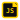

# The one Ezcord Theme

## Icon previews

A preview of the included Ezcord icons (Github from the `icons/` folder):

   
   
   
   
   
   
   
   
   
   
   
   
   
   
   

A bold neon cyberpunk dark theme with vibrant colors and maximum contrast - designed to stand out from the crowd. Now available in **4 variants** to suit every coding style!

## 🎨 Available Themes

### Ezcord Dark (Original)
The original neon cyberpunk theme with vibrant colors on a deep black background.

### Ezcord Light
A bright variant perfect for daytime coding with softened neon colors.

### Ezcord High Contrast
Maximum accessibility with pure colors (#00ff00, #ff00ff) on a pitch black background.

### Ezcord Pastel
Soft, relaxing pastel colors for extended coding sessions.

## JavaScript File example

## 📥 Installing

1. Go to Extensions in VS Code
2. Search for **'Ezcord Theme'**
3. Click Install
4. Go to Settings → Color Theme
5. Choose your preferred variant:
   - Ezcord Dark
   - Ezcord Light
   - Ezcord High Contrast
   - Ezcord Pastel

[VS Code Marketplace](https://marketplace.visualstudio.com/items?itemName=zkawiy.ezcord-theme)

[Discord server](https://discord.gg/QRcbZSBprQ)

## 🐛 Issues

If you find any weird colors or combinations, feel free to open an issue on [GitHub Issues](https://github.com/Nico4devv/ezcord-theme/issues).

## 🎨 Color Palette

### Ezcord Dark (Original)
The theme uses vibrant neon colors inspired by cyberpunk aesthetics:

- **Background**: `#0d0e10` (Deep Black)
- **Foreground**: `#e3e5e8` (Light Gray)
- **Primary Accent**: `#00ff88` (Neon Green)
- **Keywords**: `#ff0077` (Neon Pink)
- **Functions**: `#00ddff` (Neon Cyan)
- **Classes**: `#ffaa00` (Neon Orange)
- **Strings**: `#00ff88` (Neon Green)
- **Numbers**: `#ffaa00` (Neon Orange)
- **Comments**: `#5a5d62` (Muted Gray)

### Ezcord Light
Softened colors on a bright background:

- **Background**: `#ffffff` (White)
- **Foreground**: `#2b2d31` (Dark Gray)
- **Primary Accent**: `#00aa66` (Green)
- **Keywords**: `#cc0055` (Pink)
- **Functions**: `#00aacc` (Cyan)

### Ezcord High Contrast
Pure, saturated colors for maximum visibility:

- **Background**: `#000000` (Pure Black)
- **Foreground**: `#ffffff` (Pure White)
- **Primary Accent**: `#00ff00` (Pure Green)
- **Keywords**: `#ff00ff` (Pure Magenta)
- **Functions**: `#00ffff` (Pure Cyan)

### Ezcord Pastel
Soft, muted colors for a relaxing experience:

- **Background**: `#1a1625` (Deep Purple)
- **Foreground**: `#e8d5e8` (Light Lavender)
- **Primary Accent**: `#c9a7eb` (Soft Purple)
- **Keywords**: `#e89ac7` (Soft Pink)
- **Functions**: `#a8c7f0` (Soft Blue)

## ✨ What Makes It Different

- ⚫ Extremely dark background for reduced eye strain (Dark variant)
- 🌈 Bright neon colors that pop and make code instantly recognizable
- 💪 Bold keywords and function names for better code scanning
- ✨ Glowing borders and accents for active elements
- 🎮 Perfect for late-night coding sessions
- 🎨 **4 complete variants** to match your mood and environment
- ♿ Accessible high contrast option for better visibility

## 🚀 Features

All variants include:
- Full syntax highlighting for Python, JavaScript, TypeScript, JSON, YAML, Markdown, HTML, CSS
- Optimized for Discord bot development (discord.py, py-cord, ezcord)
- Custom terminal colors
- Consistent UI across all VS Code elements
- Bold styling for important code elements

## 📝 License

MIT License - see [LICENSE](LICENSE) file for details